# Missão Aurora Siger 🚀


Relatório técnico e analítico da missão fictícia **Aurora Siger**, desenvolvido como atividade integradora com foco em **telemetria espacial**, **verificação operacional**, **análise energética**, **apoio interpretativo por IA** e **reflexão crítica**.

O projeto simula o monitoramento de uma missão **Terra–Marte** a partir de uma base de telemetria fictícia com **120 leituras distribuídas ao longo de 60 dias**, permitindo avaliar o comportamento dos sistemas da nave ao longo do trajeto.

---

## Links principais da entrega 🔗

- **Repositório público:** [Aurora-Siger-Mission](https://github.com/marcusestevan/Aurora-Siger-Mission)
- **Notebook principal (.ipynb):** [relatorio-aurora-siger.ipynb](https://github.com/marcusestevan/Aurora-Siger-Mission/blob/main/relatorio-aurora-siger.ipynb)
- **Base de dados (.csv):** [telemetria_nave_spacexg_marte_relatorio.csv](https://github.com/marcusestevan/Aurora-Siger-Mission/blob/main/telemetria_nave_spacexg_marte_relatorio.csv)
- **Relatório em PDF:** [relatorio-aurora-siger.ipynb.pdf](https://github.com/marcusestevan/Aurora-Siger-Mission/blob/main/relatorio-aurora-siger.ipynb.pdf)
- **Pasta de imagens / prints:** [imgs/](https://github.com/marcusestevan/Aurora-Siger-Mission/tree/main/imgs)

---

## Objetivo do projeto 🎯

Este trabalho foi desenvolvido para atender aos requisitos da atividade integradora, contemplando:

- organização e descrição da telemetria da missão;
- construção de um algoritmo de verificação para decidir entre **PRONTO PARA DECOLAR** ou **DECOLAGEM ABORTADA**;
- implementação da lógica em Python;
- análise energética da missão;
- análise assistida por IA com classificação dos dados, identificação de anomalias e sugestões de risco;
- reflexão crítica sobre ética, impacto social e sustentabilidade tecnológica.

---

## Estrutura do repositório 📂

```text
Aurora-Siger-Mission/
├── relatorio-aurora-siger.ipynb
├── relatorio-aurora-siger.ipynb.pdf
├── telemetria_nave_spacexg_marte_relatorio.csv
├── README.md
└── imgs/
    ├── aurora_siger_timeline.png
    ├── print_energia_analise.png
    ├── print_energia_missao.png
    ├── print_energia_prelaunch.png
    ├── print_ia_periodicidade.png
    ├── print_telemetria_head.png
    ├── print_telemetria_sensores.png
    ├── print_verificacao_check.png
    ├── print_verificacao_estatisticas.png
    ├── print_verificacao_fases.png
    ├── print_verificacao_flagged.png
    └── print_verificacao_offnominal.png
```

---

## Checklist de entregáveis ✅

Este repositório foi organizado para conter os principais entregáveis solicitados na atividade:

- [x] README.md com explicação do projeto
- [x] Notebook Python (.ipynb) com a implementação da análise
- [x] Relatório em PDF com metodologia, algoritmo, análises, uso de IA e reflexão crítica
- [x] Base de dados em CSV
- [x] Prints da execução
- [x] Instruções de execução do código
- [x] Link do repositório público no GitHub

> O relatório em PDF concentra a parte mais completa da entrega acadêmica, incluindo a metodologia, o algoritmo de verificação, a análise energética, a análise assistida por IA e a reflexão crítica.

---

## Tecnologias utilizadas 🛠️

- Python 3.10+
- pandas
- numpy
- Jupyter Notebook
- Google Colab

> Caso necessário, recomenda-se incluir também um arquivo `requirements.txt` no repositório para facilitar a reprodução local do projeto.

---

## Organização da telemetria 📊

A base de dados reúne leituras simuladas da missão **Aurora Siger** ao longo de 60 dias. Os dados foram estruturados para permitir a análise operacional da nave em diferentes fases da missão, desde a decolagem até a chegada em Marte.

As variáveis observadas incluem:

- temperatura interna e externa;
- integridade estrutural;
- nível de energia;
- pressão dos tanques;
- status dos módulos críticos;
- fase da missão;
- alertas operacionais.

Esses dados são interpretados no notebook para identificar comportamento nominal, desvios operacionais e eventos críticos ao longo do voo.

### Principais campos da telemetria

| Campo | Descrição |
|---|---|
| `timestamp_utc` | Data e horário da leitura |
| `mission_day` | Dia da missão |
| `vehicle` | Identificação da nave |
| `mission` | Nome da missão |
| `phase` | Fase operacional da missão |
| `temp_internal_c` | Temperatura interna da nave |
| `temp_external_c` | Temperatura externa |
| `structural_integrity_0_1` | Integridade estrutural (0 = comprometida, 1 = íntegra) |
| `energy_level_pct` | Nível de energia em percentual |
| `fuel_tank_pressure_bar` | Pressão do tanque de combustível |
| `oxidizer_tank_pressure_bar` | Pressão do tanque de oxidante |
| `propulsion_status` | Status do sistema de propulsão |
| `life_support_status` | Status do suporte de vida |
| `navigation_status` | Status da navegação |
| `communications_status` | Status das comunicações |
| `thermal_control_status` | Status do controle térmico |
| `overall_alert` | Classificação geral da leitura |

---

## Algoritmo de verificação ⚙️

O projeto inclui um algoritmo de decisão capaz de avaliar se a nave está em condições de prosseguir com a operação ou se a decolagem deve ser abortada.

A lógica considera faixas seguras predefinidas para variáveis críticas, como:

- integridade estrutural;
- energia disponível;
- pressão dos tanques;
- temperatura interna;
- status dos módulos essenciais.

### Critérios resumidos de decisão: PRONTO PARA DECOLAR / DECOLAGEM ABORTADA

A decisão operacional considera, de forma resumida, os seguintes critérios:

- temperatura interna dentro da faixa segura;
- integridade estrutural = 1;
- energia acima do limite mínimo operacional;
- pressões dos tanques acima dos limites mínimos de segurança;
- módulos críticos em estado operacional adequado.

> Se todas as verificações estiverem dentro dos parâmetros, o sistema retorna **PRONTO PARA DECOLAR**. Caso uma ou mais condições críticas sejam violadas, o resultado passa a ser **DECOLAGEM ABORTADA**.

---

## Script em Python 🐍

O notebook implementa em Python toda a lógica de validação da missão, incluindo:

- leitura do arquivo CSV;
- organização dos dados com pandas;
- aplicação das regras de verificação;
- classificação do estado operacional;
- exibição dos resultados no notebook.

Além disso, o código realiza análises complementares para interpretação dos eventos não nominais observados na telemetria.

---

## Análise energética ⚡

O projeto apresenta uma análise da autonomia energética da missão, considerando:

- capacidade total do sistema energético;
- carga inicial disponível;
- consumo estimado nas operações;
- perdas energéticas ao longo do trajeto;
- impacto de correções e manobras na margem operacional.

A modelagem permite interpretar como a disponibilidade de energia influencia a viabilidade operacional da missão, tanto na fase de lançamento quanto no trajeto completo até Marte.

---

## Análise assistida por IA 🤖

O projeto também inclui uma etapa de análise assistida por IA, utilizada como apoio interpretativo aos dados da telemetria.

A IA foi utilizada para:

- classificar o comportamento geral da missão;
- identificar possíveis anomalias;
- destacar eventos críticos;
- sugerir riscos operacionais;
- complementar a leitura técnica produzida pelo algoritmo e pelo script em Python.

> Essa análise não substitui a validação técnica, mas amplia a interpretação qualitativa dos dados e ajuda a identificar padrões relevantes.

---

## Reflexão crítica 🌍

Além da análise computacional, o trabalho incorpora uma reflexão crítica sobre:

- ética e responsabilidade em sistemas de missão crítica;
- impacto social da exploração espacial;
- sustentabilidade tecnológica em operações de alta complexidade e alto consumo de recursos.

Essa etapa amplia o escopo do projeto para além da execução técnica, conectando os resultados a questões humanas, sociais e ambientais.

---

## Como executar 🚀

### Opção 1 — Google Colab

1. Acesse o Google Colab.
2. Vá em **Arquivo > Abrir notebook > GitHub**.
3. Cole a URL do repositório.
4. Selecione o arquivo `relatorio-aurora-siger.ipynb`.
5. Faça upload do arquivo `telemetria_nave_spacexg_marte_relatorio.csv` para o ambiente do Colab.
6. Execute as células em ordem.

### Opção 2 — Execução local

#### Pré-requisitos

- Python 3.10 ou superior
- Jupyter Notebook instalado
- Bibliotecas `pandas` e `numpy`

#### Passo a passo

```bash
git clone https://github.com/marcusestevan/Aurora-Siger-Mission.git
cd Aurora-Siger-Mission
pip install pandas numpy jupyter
jupyter notebook relatorio-aurora-siger.ipynb
```

> Para evitar erros de leitura, mantenha o arquivo CSV no mesmo diretório do notebook ou ajuste o caminho do arquivo no código.

---

## Prints da execução 📸

### Carregamento da telemetria

**Sensores monitorados**

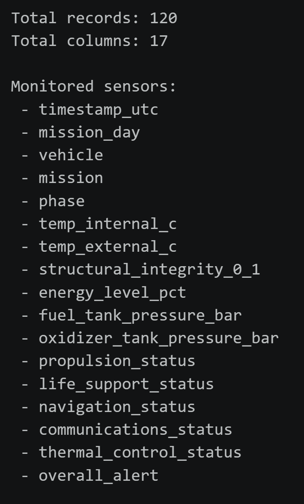

**Primeiras leituras da missão**

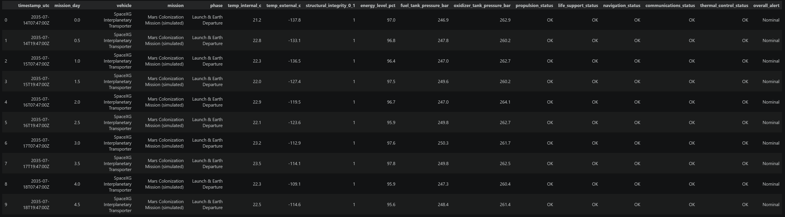

### Verificação operacional

**Fases da missão**

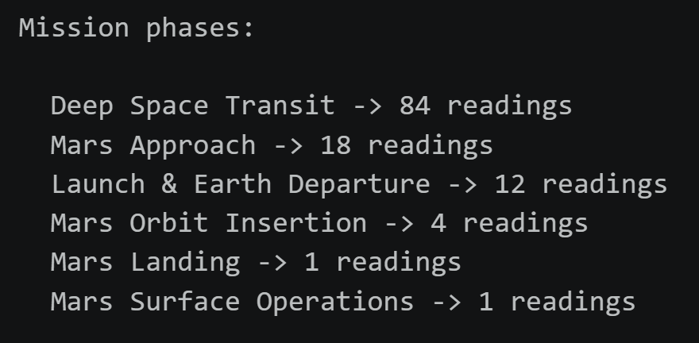

**Estatísticas dos sensores**

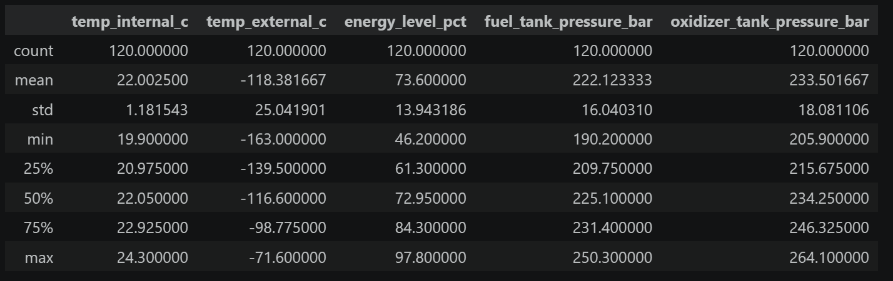

**Eventos não nominais**

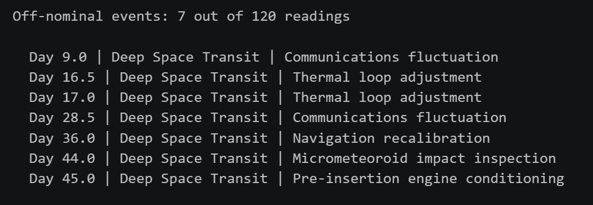

**Resultado da checagem**

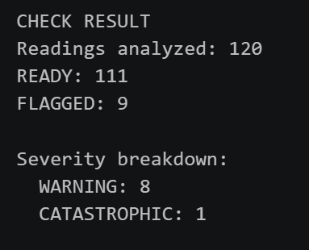

**Leituras classificadas por severidade**

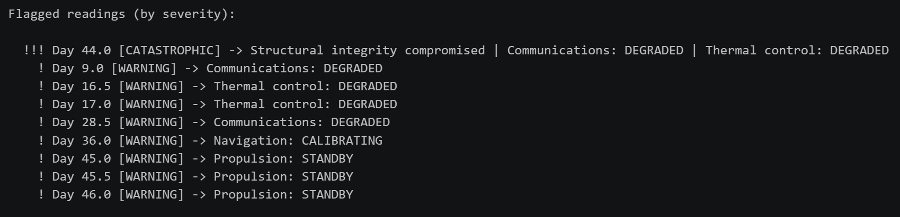

### Análise energética

**Checagem pré-lançamento**

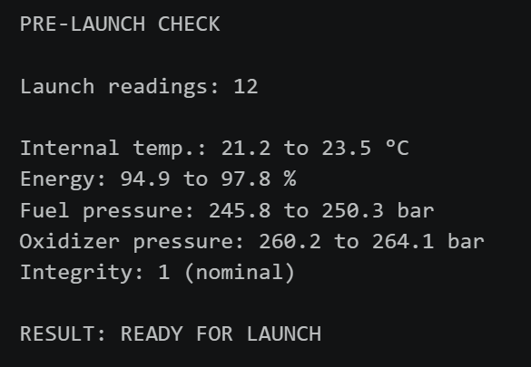

**Avaliação geral da missão**

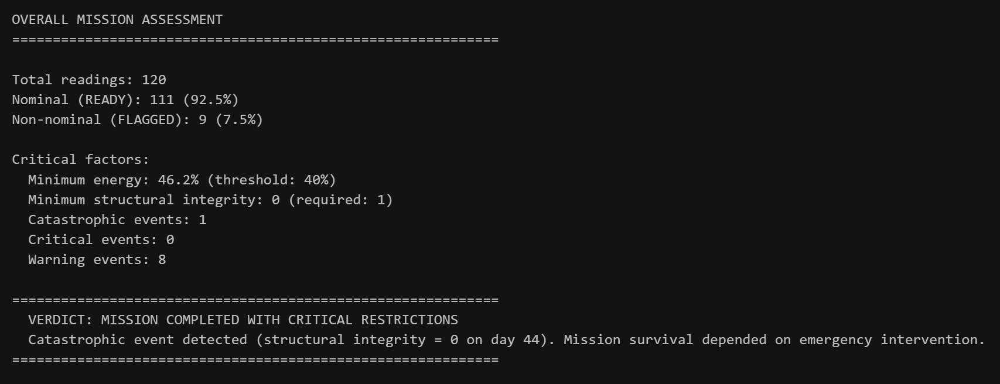

**Análise energética detalhada**

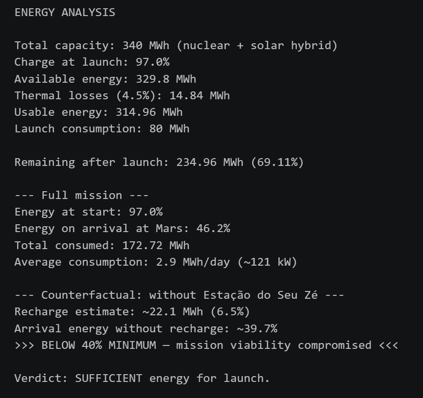

### Análise assistida por IA

**Análise de periodicidade das comunicações**

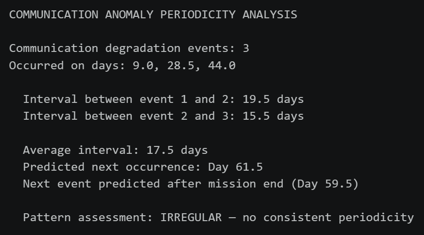

### Timeline da missão

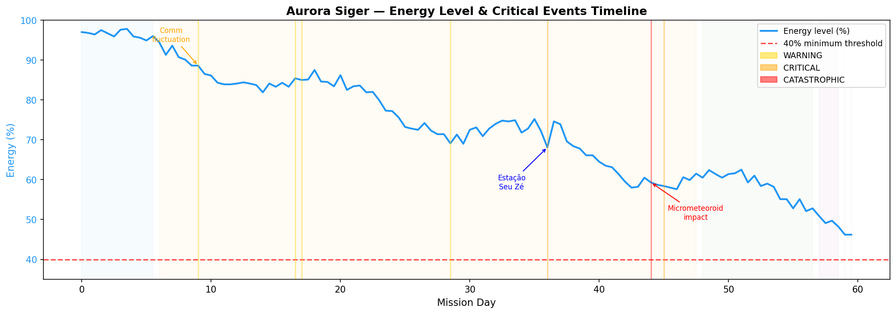

---

## Limitações do projeto ⚠️

Este projeto possui algumas limitações importantes:

- utiliza dados fictícios para fins acadêmicos;
- simplifica parte da complexidade real de uma missão espacial;
- depende de regras de decisão previamente definidas para a classificação operacional;
- a análise assistida por IA é inferencial e não substitui validação técnica humana;
- os resultados refletem o escopo da base de telemetria analisada, sem integração com históricos externos de manutenção ou contexto adicional da missão.

---

## Possíveis melhorias futuras 🔭

Como evolução do projeto, podem ser consideradas as seguintes melhorias:

- criação de um `requirements.txt` para facilitar a reprodução do ambiente;
- separação do notebook em módulos Python reutilizáveis;
- implementação de visualizações interativas;
- ampliação das regras de severidade e priorização de riscos;
- uso de testes automatizados para validar a lógica de decisão;
- comparação entre múltiplos cenários de missão;
- desenvolvimento de dashboard para acompanhamento em tempo real;
- integração com modelos preditivos para antecipação de falhas.

---

## Observações finais 📝

Este projeto utiliza **dados fictícios** para fins acadêmicos e simula uma missão espacial Terra–Marte com foco em análise computacional, energética e interpretativa.

A proposta integra programação, leitura analítica de dados, apoio de IA e reflexão crítica em uma única entrega, articulando competências técnicas e interpretativas dentro do contexto da atividade integradora.
